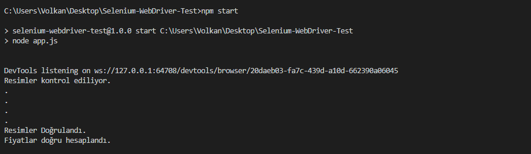

# Selenium WebDriver with NodeJS
Simple WebdriverJs project to automate tests using selenium-webdriver and node-fetch libraries

### Macte çalıştırmak için
> brew install selenium-server-standalone
### Windowsta çalıştırmak için
[Buradan indirin](https://chromedriver.storage.googleapis.com/index.html?path=76.0.3809.25/)

> Ve Bilgisayarın PATH kısmına indirdiğiniz dosyanın yolunu ekleyin. Kesinlikle pcye reset atın (Yarım saat bunun ne sorunu var dememek için :/)

> npm start

[Notlar](https://github.com/volkankahraman/Selenium-WebDriver-Test/blob/master/Notlar.md)
## Video

